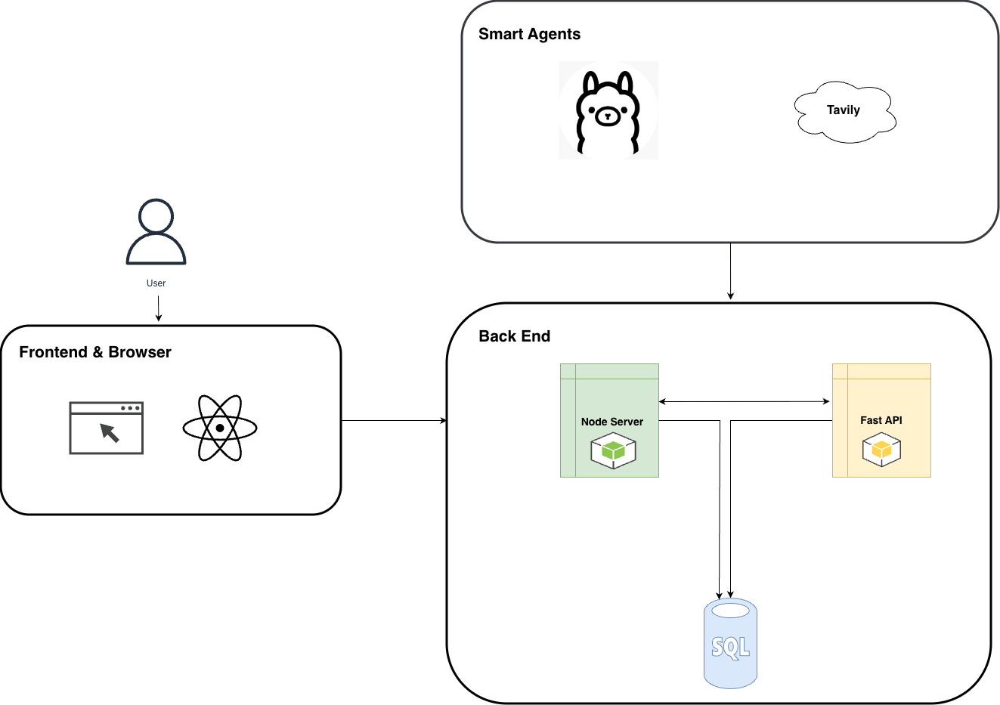

# Airbnb Prototype

A full-stack Airbnb clone with AI-powered travel planning.

## Tech Stack

- **Frontend**: React + TailwindCSS
- **Backend**: Node.js + Express + MySQL
- **AI Agent**: Python FastAPI + Langchain + Ollama (Local AI)

## Tech Design



The system follows a three-tier architecture:
- **Frontend & Browser**: React-based user interface
- **Backend**: Node.js server and Python FastAPI for AI capabilities
- **Smart Agents**: Llama (local AI) and Tavily integration for intelligent features
- **Database**: MySQL for data persistence

## Project Structure

```
airbnb/
├── frontend/          # React application
├── backend/           # Node.js/Express API
├── ai-agent/          # Python FastAPI AI service
└── database/          # MySQL schema files
```

## Prerequisites

- Node.js (v18+)
- Python (v3.9+)
- MySQL (v8+)

## Setup Instructions

### 1. Database Setup

```bash
# Login to MySQL
mysql -u root -p

# Create database
CREATE DATABASE airbnb_db;

# Import schema
mysql -u root -p airbnb_db < database/schema.sql
```

### 2. Backend Setup

```bash
cd backend
npm install
cp .env.example .env
# Edit .env with your MySQL credentials
npm run dev
```

Backend will run on `http://localhost:5000`

### 3. Frontend Setup

```bash
cd frontend
npm install
cp .env.example .env
npm start
```

Frontend will run on `http://localhost:3000`

### 4. AI Agent Setup (Ollama - Local/Offline)

```bash
# Install Ollama first
# macOS: brew install ollama
# Linux: curl -fsSL https://ollama.com/install.sh | sh
# Windows: Download from https://ollama.com/download

# Download AI model
ollama pull llama2

# Start Ollama (keep running in separate terminal)
ollama serve

# Setup AI agent (in new terminal)
cd ai-agent
python -m venv venv
source venv/bin/activate  # On Windows: venv\Scripts\activate
pip install -r requirements.txt
cp env.example .env
# Edit .env with your MySQL credentials (no API keys needed!)
uvicorn app.main:app --reload --port 8000
```

AI Agent will run on `http://localhost:8000`

**Note:** Uses Ollama (local, free, offline AI) - No API keys required!

## API Documentation

- Backend Swagger: `http://localhost:5000/api-docs`
- AI Agent Swagger: `http://localhost:8000/docs`

## Default Users

After running the seed script, you can login with:
- **Traveler**: traveler@test.com / password123
- **Owner**: owner@test.com / password123

## Features

### Traveler
- Signup/Login with session authentication
- Profile management with photo upload
- Search properties by location, dates, guests
- Book properties (Pending → Accepted/Cancelled flow)
- Manage favorites
- View booking history
- AI Travel Planner assistant

### Owner
- Signup/Login
- Profile management
- Post/edit properties
- Manage bookings (Accept/Cancel requests)
- View booking history

### AI Agent
- Day-by-day travel itinerary
- Activity recommendations
- Restaurant suggestions (dietary filters)
- Packing checklist (weather-aware)
- Natural language understanding

## Development

- Backend API runs on port 5000
- Frontend runs on port 3000
- AI Agent runs on port 8000

## Contributors

- Developed for Lab 1 Assignment

