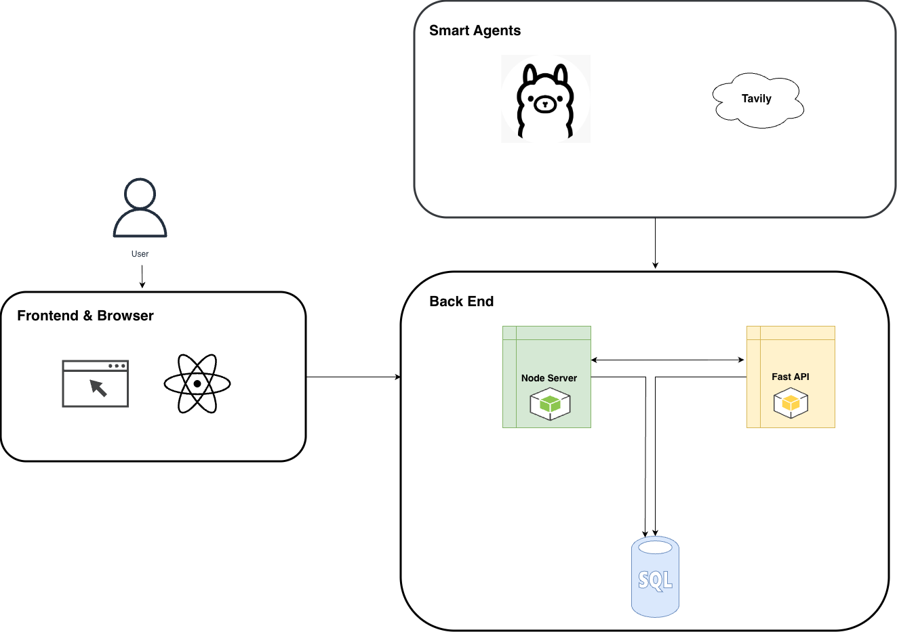
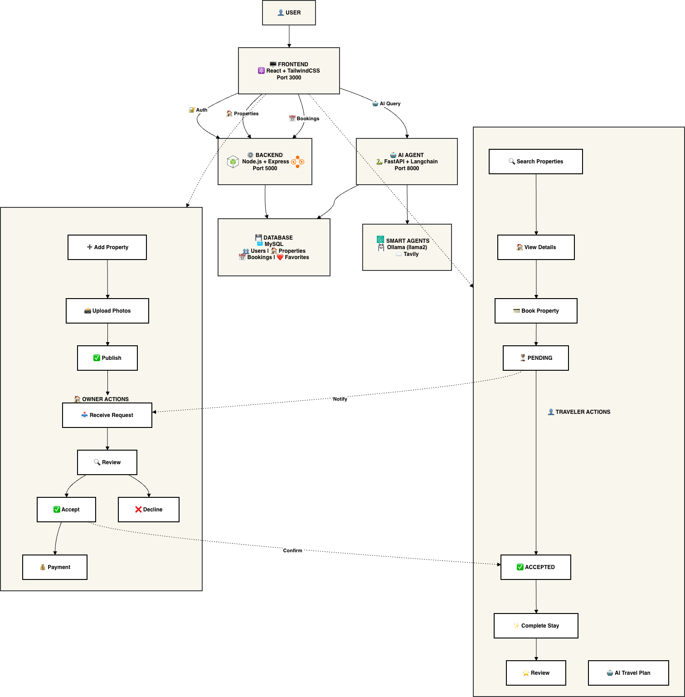

# Airbnb Prototype
A full-stack Airbnb clone with AI-powered travel planning.

## Tech Stack

- **Frontend**: React + TailwindCSS + Redux Toolkit
- **Backend**: Node.js + Express + Mongoose
- **Database**: MongoDB (Primary), MySQL (Legacy support)
- **Message Queue**: Apache Kafka (for asynchronous messaging)
- **AI Agent**: Python FastAPI + Langchain + OpenAI
- **Orchestration**: Docker + Kubernetes
- **Session Store**: MongoDB (connect-mongo)
- **State Management**: Redux with Redux Toolkit

## Tech Design



The system follows a three-tier architecture:
- **Frontend & Browser**: React-based user interface
- **Backend**: Node.js server and Python FastAPI for AI capabilities
- **Smart Agents**: OpenAI (GPT-3.5-turbo) and Tavily integration for intelligent features
- **Database**: MySQL for data persistence

## Workflow
Please note, we have built a three tier structure in an addition to the Agentic AI. Our project encompasses Frontend, Backend, Database and Smart Agent also been depicted by the workflow diagram as given below:

 


### Traveler Workflow
1. **Search & Browse**: Search properties by location, dates, and guests
2. **View Details**: View property information and photos
3. **Book Property**: Submit booking request (status: PENDING)
4. **Await Confirmation**: Owner reviews and accepts/declines the request
5. **Complete Stay**: Once accepted, complete the stay
6. **Post-Stay**: Leave a review and get AI travel planning recommendations

### Owner Workflow
1. **Add Property**: Create new property listing
2. **Upload Photos**: Add property images
3. **Publish**: Make property available for bookings
4. **Receive Requests**: Get notified of booking requests
5. **Review & Decide**: Accept or decline booking requests
6. **Process Payment**: Complete payment for accepted bookings

## Project Structure

```
airbnb/
├── frontend/          # React application
├── backend/           # Node.js/Express API
├── ai-agent/          # Python FastAPI AI service
└── database/          # MySQL schema files
```

## Prerequisites

- Node.js (v18+)
- Python (v3.9+)
- MySQL (v8+)

## 🚀 Quick Start

**New to the project?** Check out the **[run-guide](./run-guide/)** folder for all setup and running instructions!

### Docker & Kubernetes (Lab 2)
```bash
# Automated deployment to Kubernetes
./deploy.sh

# Or use Docker Compose for local testing
docker-compose up -d
```

See **[Guide/DOCKER_KUBERNETES.md](./Guide/DOCKER_KUBERNETES.md)** for complete Docker and Kubernetes setup.

### One-Command Start (Development)
```bash
cd run-guide
./start-all.sh
```

### Manual Setup
See **[run-guide/README.md](./run-guide/README.md)** for detailed instructions.

## 📚 Documentation

All setup guides, documentation, and scripts are organized in the **[run-guide](./run-guide/)** folder:
- Setup instructions
- Running guides  
- AI configuration
- Project structure details

### Lab 2 Documentation

- **[Guide/LAB2_REPORT.md](./Guide/LAB2_REPORT.md)** - 📊 **Complete Lab 2 Submission Report**
- **[Guide/DOCKER_KUBERNETES.md](./Guide/DOCKER_KUBERNETES.md)** - Docker & Kubernetes setup (Part 1)
- **[Guide/KAFKA_SETUP.md](./Guide/KAFKA_SETUP.md)** - Kafka asynchronous messaging (Part 2)
- **[Guide/MONGODB_REDUX_SETUP.md](./Guide/MONGODB_REDUX_SETUP.md)** - MongoDB & Redux integration (Parts 3 & 4)
- **[Guide/JMETER_TESTING.md](./Guide/JMETER_TESTING.md)** - JMeter performance testing (Part 5)
- **[Guide/PART2_VERIFICATION.md](./Guide/PART2_VERIFICATION.md)** - Part 2 verification checklist

## Detailed Setup Instructions

### 1. Database Setup

```bash
# Login to MySQL
mysql -u root -p

# Create database
CREATE DATABASE airbnb_db;

# Import schema
mysql -u root -p airbnb_db < database/schema.sql
```

### 2. Backend Setup

```bash
cd backend
npm install
cp .env.example .env
# Edit .env with your MySQL credentials
npm run dev
```

Backend will run on `http://localhost:5000`

### 3. Frontend Setup

```bash
cd frontend
npm install
cp .env.example .env
npm start
```

Frontend will run on `http://localhost:3000`

### 4. AI Agent Setup (OpenAI)

```bash
cd ai-agent
python -m venv venv
source venv/bin/activate  # On Windows: venv\Scripts\activate
pip install -r requirements.txt
cp env.example .env
# Edit .env with:
#   - Your MySQL credentials
#   - OPENAI_API_KEY (get from https://platform.openai.com/api-keys)
#   - TAVILY_API_KEY (get from https://tavily.com/)
uvicorn app.main:app --reload --port 8000
```

AI Agent will run on `http://localhost:8000`

**Note:** Requires OpenAI API key. Get yours at https://platform.openai.com/api-keys

## API Documentation

- Backend Swagger: `http://localhost:5000/api-docs`
- AI Agent Swagger: `http://localhost:8000/docs`

## Default Users

After running the seed script, you can login with:

| Role     | Email              | Password   | Status      |
|----------|--------------------|-----------|-------------|
| Traveler | traveler@test.com  | password123 | ✅ Working |
| Traveler | mike@test.com      | password123 | ✅ Working |
| Owner    | owner@test.com     | password123 | ✅ Working |
| Owner    | emma@test.com      | password123 | ✅ Working |

## Features

### Traveler
- Signup/Login with session authentication
- Profile management with photo upload
- Search properties by location, dates, guests
- Book properties (Pending → Accepted/Cancelled flow)
- Manage favorites
- View booking history
- AI Travel Planner assistant

### Owner
- Signup/Login
- Profile management
- Post/edit properties
- Manage bookings (Accept/Cancel requests)
- View booking history

### AI Agent
- Day-by-day travel itinerary
- Activity recommendations
- Restaurant suggestions (dietary filters)
- Packing checklist (weather-aware)
- Natural language understanding

## Development

- Backend API runs on port 5000
- Frontend runs on port 3000
- AI Agent runs on port 8000

## Contributors

- Vidushi Verma
- Shristi Kumar

Developed for Lab 1 Assignment

